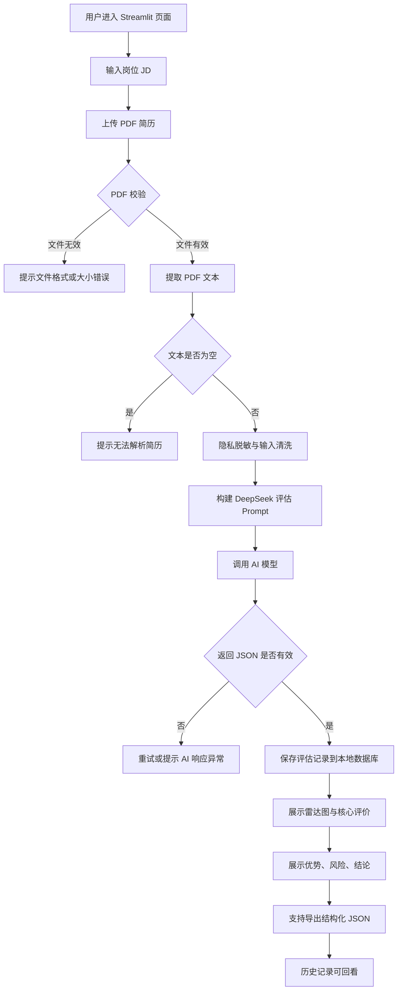

# AIHR 简历初筛

AIHR 简历初筛是一个基于 Streamlit 与 DeepSeek-V3 的简历智慧分析平台。系统面向 HR、招聘助理与业务面试官，支持上传 PDF 简历、输入岗位 JD，并自动生成候选人画像、五维评分、关键优势、潜在风险、最终初筛建议与结构化 JSON 结果。

## 1. 项目截图

> 当前项目以 Streamlit Web 页面运行，
### 1.1 首页与评估配置区


### 1.2 分析结果区


- 胜任力雷达图
- 综合匹配得分
- 候选人画像
- 最终建议
- 关键优势与潜在风险
- JSON 结果导出按钮
- 最近分析记录

### 1.3 本地运行

```bash
pip install -r requirements.txt
streamlit run app.py
```


## 2. 功能流程图



## 3. 核心功能

| 模块 | 功能说明 |
| --- | --- |
| JD 输入 | 支持自定义岗位职责、任职要求、优先条件，默认提供 AI-HR Star 岗位描述。 |
| PDF 上传 | 仅允许 PDF 简历，配合文件校验避免异常输入。 |
| 文本解析 | 本地提取 PDF 非结构化文本，降低手动复制成本。 |
| 隐私保护 | 使用正则脱敏手机号、邮箱等敏感信息，并对输入进行清洗。 |
| AI 评估 | 调用 DeepSeek API，基于 JD 与简历进行多维度匹配分析。 |
| JSON 校验 | 对 AI 返回结果进行字段、分值范围、结论枚举校验。 |
| 可视化展示 | 生成五维胜任力雷达图、综合分、候选人画像、优势与风险。 |
| 历史记录 | 自动保存最近评估记录，便于回看候选人结果。 |
| 数据导出 | 支持将结构化评估报告导出为 JSON 文件。 |

## 4. 评分规则

系统采用五维度评分，每个维度为 0-100 分，综合匹配得分为五个维度的平均分。

### 4.1 评分维度

| 维度 | 字段 | 权重 | 评分关注点 |
| --- | --- | --- | --- |
| 专业技能 | `skill_score` | 20% | Python、SQL、AI 工具、数据分析、自动化工具、岗位关键技能覆盖度。 |
| 项目深度 | `project_score` | 20% | 项目复杂度、候选人角色、业务影响、量化成果、端到端落地经验。 |
| 学历背景 | `edu_score` | 20% | 学校层次、专业相关度、学历匹配度、课程或科研经历。 |
| 逻辑思维 | `logic_score` | 20% | 简历表达结构、问题拆解能力、数据化表达、因果链条清晰度。 |
| 腾讯匹配度 | `tencent_fit` | 20% | 与岗位 JD、腾讯业务场景、协作文化、用户价值导向的匹配程度。 |

综合分计算方式：

```text
综合匹配得分 = round((skill_score + project_score + edu_score + logic_score + tencent_fit) / 5)
```

### 4.2 分数区间解释

| 分数区间 | 解释 | 建议动作 |
| --- | --- | --- |
| 85-100 | 高度匹配，技能、项目与岗位要求高度一致。 | 优先进入面试。 |
| 70-84 | 基本匹配，存在部分短板但可通过面试进一步确认。 | 进入面试或人才储备。 |
| 60-69 | 弱匹配，仅部分条件满足，风险较明显。 | 谨慎推进，建议人才储备。 |
| 0-59 | 匹配度低，关键要求缺失。 | 不建议进入当前岗位流程。 |

### 4.3 最终结论规则

AI 返回的 `verdict` 必须为以下三类之一：

| 结论 | 适用条件 |
| --- | --- |
| 进入面试 | 综合分较高，且关键岗位要求基本满足，风险可通过面试验证。 |
| 人才储备 | 有部分亮点，但岗位匹配度或稳定性存在不确定性，适合后续岗位池跟进。 |
| 不匹配 | 核心技能、经验或背景与 JD 偏差明显，不建议进入当前岗位面试。 |

## 5. Prompt 示例

### 5.1 System Prompt

```text
你是一名腾讯人力资源专家。请基于事实严谨评估简历，严禁幻觉。必须输出JSON格式。
```

### 5.2 User Prompt 模板

```text
【任务】请对比以下岗位要求(JD)与候选人简历，进行多维度胜任力打分。
【岗位要求(JD)】：{jd}
【简历内容】：{resume_text}

【输出规范】请返回 JSON 对象，包含：
1. portrait: 核心背景画像(30字内)
2. skill_score: 专业技能分(0-100)
3. project_score: 项目实战分(0-100)
4. edu_score: 学历背景分(0-100)
5. logic_score: 逻辑思辨分(0-100)
6. tencent_fit: 腾讯文化匹配度(0-100)
7. highlights: 3个核心竞争力点
8. risks: 潜在风险点
9. verdict: 最终结论(进入面试/人才储备/不匹配)
```

### 5.3 示例输入

```text
岗位要求(JD)：
岗位：AI-HR Star。要求：211/985背景，熟悉Python/SQL，具备AI工具应用和数据分析能力。

简历内容：
候选人本科就读于某 985 高校信息管理专业，熟悉 Python、SQL、Excel、Tableau，曾参与招聘数据看板建设，使用大模型辅助生成面试问题，并完成候选人漏斗分析。
```

### 5.4 示例输出

```json
{
  "portrait": "985背景的数据分析型HR候选人",
  "skill_score": 88,
  "project_score": 82,
  "edu_score": 92,
  "logic_score": 84,
  "tencent_fit": 86,
  "highlights": [
    "具备Python、SQL与数据可视化能力，覆盖岗位关键技能",
    "有招聘数据看板和候选人漏斗分析经验，贴近AI-HR业务场景",
    "具备大模型工具应用意识，可支持HR流程自动化"
  ],
  "risks": [
    "简历中缺少大规模业务落地指标",
    "AI工具应用深度仍需通过面试确认"
  ],
  "verdict": "进入面试"
}
```

## 6. 项目结构

```text
AI-HR简历初筛/
├── app.py                     # Streamlit 主入口
├── requirements.txt           # Python 依赖
├── .gitignore                 # Git 忽略配置
├── .streamlit/
│   ├── secrets.toml           # 本地 API Key 配置，不提交
│   └── secrets.toml.example   # 配置示例
└── src/
    ├── ai_agent.py            # AI 调用、JSON 校验、重试逻辑
    ├── batch_processor.py     # 批处理相关能力
    ├── config.py              # 全局配置、Prompt 模板、DeepSeek 客户端
    ├── database.py            # 本地评估记录存储
    ├── pdf_utils.py           # PDF 校验与文本提取
    ├── privacy.py             # 隐私脱敏与输入清洗
    └── visualization.py       # 雷达图与展示组件
```

## 7. 配置说明

项目优先从 `.streamlit/secrets.toml` 读取 DeepSeek API Key，也支持环境变量 `DEEPSEEK_API_KEY`。

`.streamlit/secrets.toml` 示例：

```toml
[deepseek]
api_key = "your_deepseek_api_key"
```

如果未配置 API Key，页面会提示配置方式并停止运行，避免无效请求。

## 8. 项目总结

本项目完成了从简历上传、文本解析、隐私脱敏、AI 结构化评估、结果可视化到历史记录保存的完整闭环，适合作为 AI+HR 场景下的简历初筛原型。

### 8.1 项目亮点

- **业务闭环完整**：覆盖 JD 输入、简历解析、AI 评估、结果展示、历史回看与 JSON 导出。
- **输出结构稳定**：通过 `response_format={"type":"json_object"}`、必填字段校验与分值范围校验，降低大模型输出不可控风险。
- **隐私保护前置**：在调用云端模型前进行本地脱敏与清洗，减少敏感个人信息外传。
- **可解释性较强**：不仅给出分数，还提供候选人画像、优势、风险和最终建议，方便 HR 快速决策。
- **可视化友好**：五维雷达图能够直观展示候选人与岗位要求的匹配结构。

### 8.2 当前限制

- 评分仍依赖大模型判断，不能替代正式招聘决策。
- PDF 解析质量受简历格式影响，扫描件或图片型 PDF 可能无法准确提取文本。
- 目前综合分为五维平均权重，尚未针对不同岗位动态调整权重。
- 当前版本主要支持单份简历分析，批量分析能力可进一步完善前端入口。

### 8.3 后续优化方向

- 增加批量上传与候选人排序功能。
- 支持不同岗位模板与可配置评分权重。
- 引入 OCR，提高图片型 PDF 的解析能力。
- 增加 Excel/CSV 导出，便于 HR 建立候选人台账。
- 增加人工复核标签，沉淀企业内部招聘反馈数据。
- 建立 Prompt 版本管理与评估集，持续校准模型输出质量。

## 9. 免责声明

AI 评估结果仅用于辅助初筛，不能作为录用或淘汰候选人的唯一依据。实际招聘流程仍需结合面试表现、业务需求、合规要求与人工复核结果综合判断。
